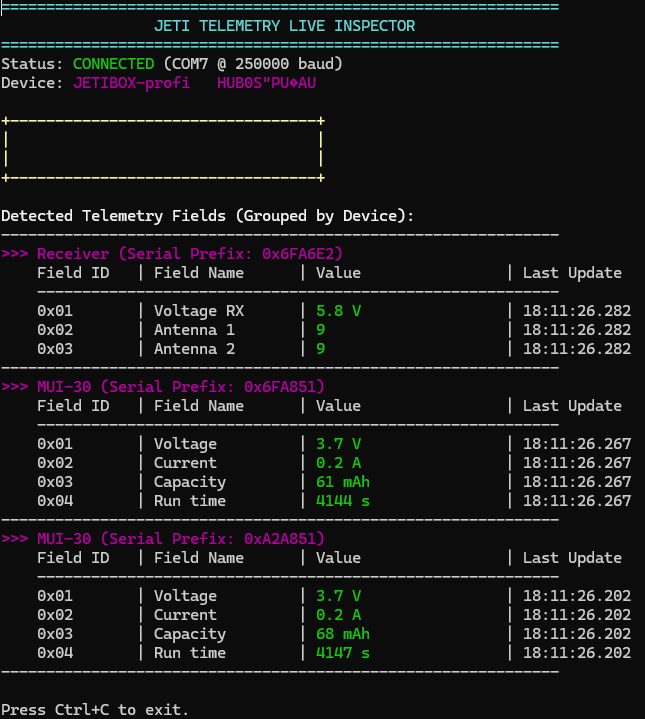

# Jeti Live Telemetry Inspector #
A small tool used to inspect telemtry from a connected Jeti USB device that is receiving and relaying EX-Bus telemetry data. Specifically tested with the JetiBox Profi and multiple sensors.

## Sensors Tested ##
I have several sensors, but these are the ones I've tested so far.
- R5-L Receiver
- MUI-30 Voltage/Current Sensor
- MT-125 Temperature Sensor

## Running ##
Download one of the binary releases (or build using Go 1.20+).

```bash
jeti_inspector.exe -port COM7
```



